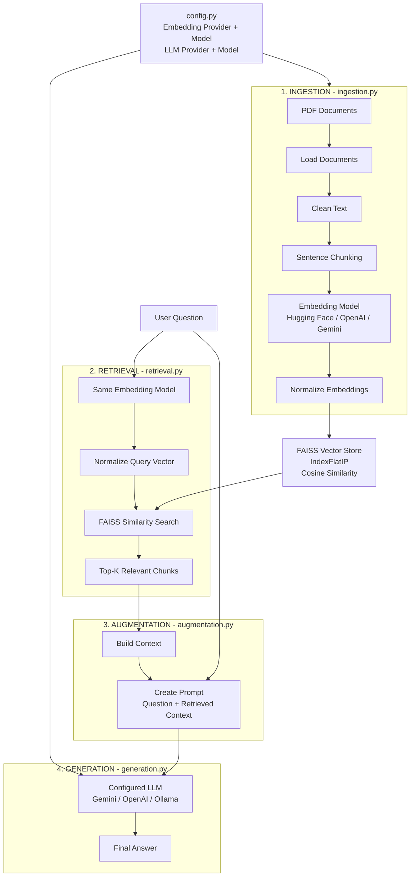

## Configurable RAG Architecture

### RAG Flow

**Ingestion**

`PDF → Load → Clean → Chunk → Embedding → Normalize → FAISS`

**Retrieval**

`Question → Same Embedding Model → Normalize → FAISS Search → Top-K Chunks`

**Augmentation**

`Question + Retrieved Chunks → Context → Prompt`

**Generation**

`Prompt → Configured LLM → Final Answer`

> **Important:** Document embeddings and query embeddings must use the same embedding model.  
> The embedding provider and LLM provider can be different.